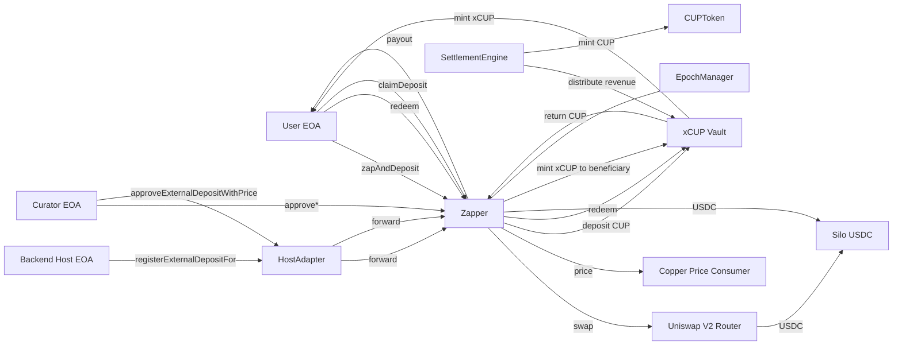
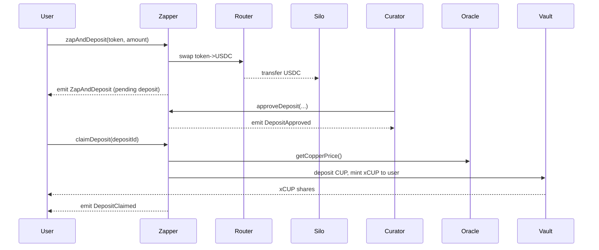

# Alcum Smart Contracts

> WARNING
> - no audits have been done on this code base
> - no warranties
> - this code is in progress and intended for demonstration/starting your project. Do your own QA & audits before use in production

## What is this?

On-chain contracts for the Alcum protocol:
- `CUPToken`: protocol asset representing copper-backed value
- `xCUP` (ERC-4626): vault that accepts CUP and mints vault shares
- `Zapper`: user entry/exit that zaps assets to USDC, manages async approvals, and mints/burns xCUP on claim/redeem
- `EpochManager`: tracks epoch windows gating approvals/claims
- `SettlementEngine`: records revenue and distributes to the vault
- `HostAdapter`: isolated adapter for host-to-host integrations to register external deposits without moving USDC on-chain

## How it works (high-level)

1) User flow (on-chain deposits)
- User calls `Zapper.zapAndDeposit(token, amount)` (ETH/any ERC20). Zapper swaps to USDC and records a pending deposit.
- Curator approves deposits (single or proportional) during an active epoch.
- User calls `claimDeposit(depositId)`. Zapper converts approved USDC value to CUP (using price), deposits CUP into `xCUP`, and mints xCUP to the user.
- User can later redeem xCUP for USDC via Zapper.

2) Host-to-host (external) flow (no on-chain USDC transfer at registration)
- Backend (with `HOST_OPERATOR_ROLE` on `HostAdapter`) calls `registerExternalDepositFor(beneficiary, usdcAmount, tag)`.
- Curator (with `CURATOR_OPERATOR_ROLE` on `HostAdapter`) calls `approveExternalDepositWithPrice(depositId, approvedUsdc, price)` to snapshot price and fix CUP amount.
- Beneficiary (or originator) calls `Zapper.claimDeposit(depositId)` and receives xCUP minted to beneficiary.

See docs/Developer_Quick_Reference.md for a detailed integration guide, security notes, and code samples (Node.js, Java, JSON-RPC).

## Requirements

- Node.js 18+ (Hardhat recommends Node 20+)
- Yarn (via Corepack or standalone)
- Foundry (optional, for Forge tests): `curl -L https://foundry.paradigm.xyz | bash && foundryup`

## Quick start

1) Install deps
```
yarn install --frozen-lockfile
```

2) Environment
Create `.env` with at least:
```
RPC_URL=https://ethereum-sepolia-rpc.publicnode.com
PRIVATE_KEY=0xYOUR_PRIVATE_KEY
COINMARKETCAP_API_KEY=
ETHERSCAN_KEY=
```

3) Compile
```
yarn compile
```

4) Run tests
- Hardhat (TypeScript):
```
yarn test
```
- Foundry (Solidity):
```
forge test -vvv
```

5) Deploy (example Hardhat script)
```
yarn deploy --network sepolia
```

## External Depositor (HostAdapter) quick guide

Roles
- Grant Zapper: `grantRole(HOST_INTEGRATION_ROLE, hostAdapterAddress)`
- Grant HostAdapter: `grantRole(HOST_OPERATOR_ROLE, backendEOA)`, `grantRole(CURATOR_OPERATOR_ROLE, curatorEOA)`

Flow
1) Backend: `HostAdapter.registerExternalDepositFor(beneficiary, usdcAmount, tag)`
2) Curator: `HostAdapter.approveExternalDepositWithPrice(depositId, approvedUsdc, price)`
3) Beneficiary or originator: `Zapper.claimDeposit(depositId)` → xCUP minted to beneficiary

Irreversibility
- Before approval, beneficiary can be adjusted by host.
- After approval, deposit parameters are locked; after claim, the process is finalized.

Important
- Zapper must hold or be able to mint sufficient CUP for claims.
- Claims require an active epoch.

## Scripts

- `yarn compile` – compile contracts
- `yarn test` – run Hardhat tests
- `yarn deploy` – run `scripts/deploy.ts`

## Development tips

- If using mainnet/testnet fork, set `RPC_URL` to a reliable endpoint (Infura/Alchemy/etc.).
- Hardhat warns on unsupported Node.js versions; Node 20 LTS is recommended.

## Visual Architecture

### System Overview



### Async Approval & Claim Timeline



## Support & Contributing

Issues and contributions are welcome.

## License

[Apache License 2.0](LICENSE)
