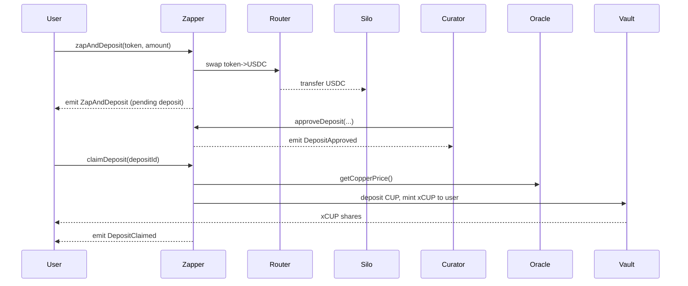
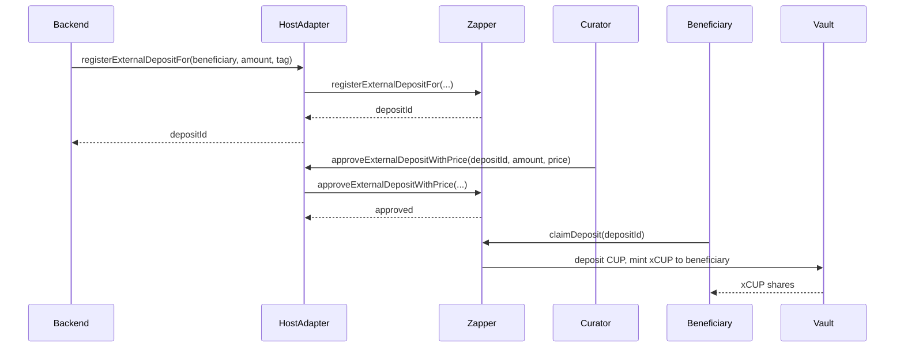
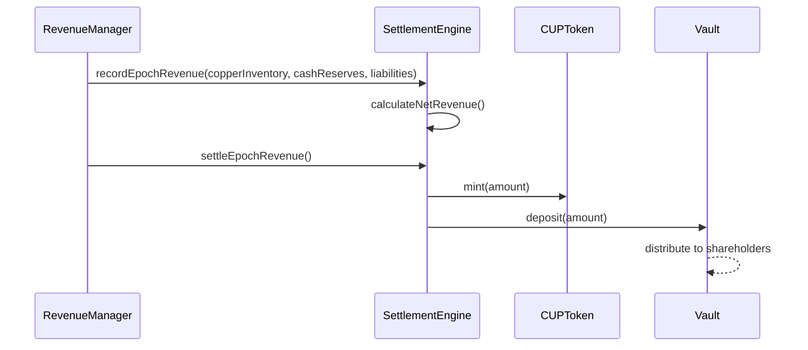

# Alcum Smart Contracts

## Overview

Alcum is a DeFi protocol that enables copper-backed value management through a comprehensive ecosystem of smart contracts. The protocol allows users to deposit various tokens (ETH, USDC, etc.) which are converted to copper-backed CUP tokens and deposited into an ERC-4626 vault, creating a bridge between traditional commodities and decentralized finance.

### Key Features

-   **🔄 Token Zapping**: Convert any ERC-20 token to copper-backed CUP tokens
-   **🏦 ERC-4626 Vault**: Standardized vault interface for CUP token deposits
-   **⏰ Epoch Management**: Time-based trading cycles and revenue settlement
-   **💰 Revenue Distribution**: Automated settlement and distribution of trading profits
-   **🔗 Oracle Integration**: Real-time copper price feeds via Chainlink
-   **🌐 Host Integration**: External system integration for off-chain deposits

## Architecture

### Core Contracts

| Contract                  | Purpose                                 | Key Features                                              |
| ------------------------- | --------------------------------------- | --------------------------------------------------------- |
| **`CUPToken`**            | Copper-backed ERC-20 token              | Mintable/burnable, 6 decimals, role-based access          |
| **`xCUP`**                | ERC-4626 vault for CUP tokens           | Share-based deposits, controlled redemptions              |
| **`Zapper`**              | Token conversion and deposit management | Multi-token support, async approvals, Uniswap integration |
| **`EpochManager`**        | Time-based epoch management             | Configurable durations, epoch progression                 |
| **`SettlementEngine`**    | Revenue tracking and distribution       | NAV calculations, profit distribution                     |
| **`CopperPriceConsumer`** | Chainlink oracle integration            | Real-time copper prices, manual updates                   |
| **`HostAdapter`**         | External system integration             | Off-chain deposit registration, role separation           |
| **`Silo`**                | USDC temporary storage                  | Unlimited approvals, seamless operations                  |

### Role-Based Access Control

| Role                        | Contracts           | Permissions                          |
| --------------------------- | ------------------- | ------------------------------------ |
| **`DEFAULT_ADMIN_ROLE`**    | All contracts       | Full administrative control          |
| **`VAULT_CURATOR_ROLE`**    | Zapper              | Approve/decline user deposits        |
| **`HOST_INTEGRATION_ROLE`** | Zapper              | Register external deposits           |
| **`HOST_OPERATOR_ROLE`**    | HostAdapter         | Register/update external deposits    |
| **`CURATOR_OPERATOR_ROLE`** | HostAdapter         | Approve external deposits with price |
| **`MINTER_ROLE`**           | CUPToken            | Mint new CUP tokens                  |
| **`BURNER_ROLE`**           | CUPToken            | Burn CUP tokens                      |
| **`REDEEMER_ROLE`**         | xCUP                | Redeem user shares                   |
| **`REVENUE_MANAGER_ROLE`**  | SettlementEngine    | Manage revenue settlement            |
| **`EPOCH_MANAGER_ROLE`**    | EpochManager        | Advance epochs, update duration      |
| **`PRICE_UPDATER_ROLE`**    | CopperPriceConsumer | Manual price updates                 |

## How It Works

### 1. Direct User Flow (On-Chain)



### 2. Host-to-Host Flow (External)



### 3. Revenue Settlement Flow



## Requirements

-   **Node.js 18+** (Hardhat recommends Node 20+)
-   **Yarn** (via Corepack or standalone)
-   **Foundry** (optional, for Forge tests):
    ```bash
    curl -L https://foundry.paradigm.xyz | bash && foundryup
    ```

## Quick Start

### 1. Install Dependencies

```bash
yarn install --frozen-lockfile
```

### 2. Environment Setup

Create `.env` with at least:

```env
RPC_URL=https://ethereum-sepolia-rpc.publicnode.com
PRIVATE_KEY=0xYOUR_PRIVATE_KEY
COINMARKETCAP_API_KEY=
ETHERSCAN_KEY=
```

### 3. Compile Contracts

```bash
yarn compile
```

### 4. Run Tests

**Hardhat (TypeScript):**

```bash
yarn test
```

**Foundry (Solidity):**

```bash
forge test -vvv
```

### 5. Deploy

```bash
yarn deploy --network sepolia
```

## Usage Examples

### Basic Zapping

```typescript
// Zap ETH to xCUP
await zapper.zapAndDeposit(ETH_ADDRESS, ethers.parseEther("1.0"));

// Zap USDC to xCUP
await zapper.zapAndDeposit(USDC_ADDRESS, ethers.parseUnits("1000", 6));
```

### Curator Operations

```typescript
// Approve a deposit
await zapper.approveDeposit(depositId, approvedAmount);

// Approve with proportional distribution
await zapper.approveDepositsProportionally(totalApprovedAmount);
```

### External Deposit Integration

```typescript
// Register external deposit
const depositId = await hostAdapter.registerExternalDepositFor(beneficiary, usdcAmount, integrationTag);

// Approve with price snapshot
await hostAdapter.approveExternalDepositWithPrice(depositId, approvedAmount, copperPrice);
```

### Revenue Management

```typescript
// Record epoch revenue
await settlementEngine.recordEpochRevenue(copperInventory, cashReserves, liabilities);

// Settle and distribute
await settlementEngine.settleEpochRevenue();
```

## Development

### Available Scripts

-   `yarn compile` – Compile contracts
-   `yarn test` – Run Hardhat tests
-   `yarn deploy` – Deploy contracts
-   `forge test -vvv` – Run Foundry tests

### Testing

The project includes comprehensive test suites for all contracts:

-   **Unit Tests**: Individual contract functionality
-   **Integration Tests**: Cross-contract interactions
-   **Role Tests**: Access control verification
-   **Edge Cases**: Error conditions and boundary testing

### Gas Optimization

All contracts are optimized for gas efficiency:

-   Packed storage slots
-   Minimal external calls
-   Efficient role-based access control
-   Upgradeable proxy patterns

## Security Considerations

### Access Control

-   Role-based permissions with OpenZeppelin AccessControl
-   Multi-signature requirements for critical operations
-   Time-locked administrative functions

### Upgrade Safety

-   Transparent proxy patterns for upgradeable contracts
-   Storage gap preservation for future upgrades
-   Initialization protection against reentrancy

### Oracle Security

-   Chainlink oracle integration for reliable price feeds
-   Manual price update capabilities for emergencies
-   Price validation and sanity checks

## Integration Guide

### For Developers

See [`docs/Developer_Quick_Reference.md`](docs/Developer_Quick_Reference.md) for detailed integration guides, security notes, and code samples.

### For External Systems

The `HostAdapter` contract provides a clean interface for external systems to integrate with the protocol without requiring direct interaction with core contracts.

## Contributing

Issues and contributions are welcome! Please feel free to submit issues and enhancement requests.

## License

[Apache License 2.0](LICENSE)
