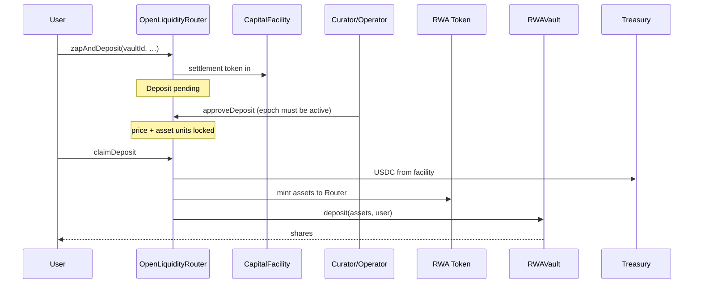
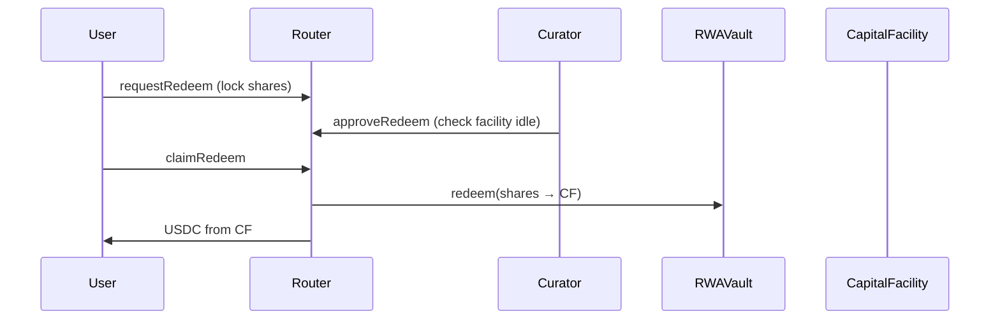
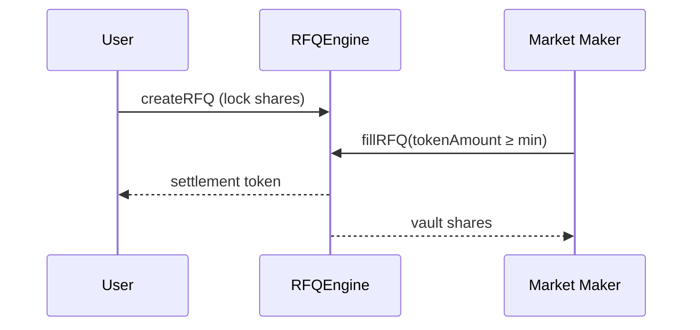
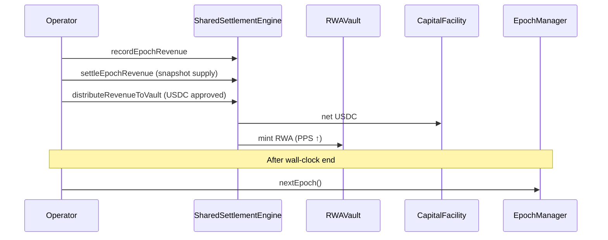

# OpenRWA / Alcum v2 — Platform Technical Specification

**Product:** Alcum OpenRWA Protocol v2 (multi-vault)  
**Document type:** Unified Technical Specification Document (Unus Nullus §1) — **v2 only**  
**Code root:** `contracts/v2/`, shared `contracts/EpochManager.sol`  
**Source of truth:** Solidity under `contracts/v2/` (code wins on conflicts)  

Related docs: [v2_Contract_Reference.md](./v2_Contract_Reference.md) (per-contract ABI / flows / trust model) · [v2-protocol.md](./v2-protocol.md) · [ISSUER_INTEGRATION_GUIDE.md](./ISSUER_INTEGRATION_GUIDE.md) · [Epochs_Technical_Specification.md](./Epochs_Technical_Specification.md)

---

## 1. Purpose and scope

This document is the **complete Technical Specification** for the **v2 multi-vault RWA protocol**. It expands every Unus Nullus §1 item:

| §1 requirement | Section |
|---|---|
| System architecture | §2 |
| Product components (why / how / who) | §3 |
| Smart-contract interactions & money flows | §4 |
| User lifecycle | §5 |
| Operation sequences | §6 |
| Role permissions | §7 |
| All system states | §8 |
| Flow diagrams | §6, §9 |
| API / interfaces | §10 |

**Out of scope:** legacy **xCUP** stack (Current Vault). v2 is the factory-based New Vault platform.

### 1.1 What problem v2 solves

v1 binds the product to a single copper vault (`xCUP`) and a fixed set of contracts. v2 generalises that model:

- **Many vaults** for different RWAs / issuers, each with isolated custody and operators.
- **One shared UX surface** (`OpenLiquidityRouter` + `RFQEngine`) so integrators do not redeploy entry points per asset.
- **Instant liquidity (T+0)** via market makers without waiting for curator-funded facility balance.
- **Optional epochs** per vault (or continuous NAV-only mode).

---

## 2. System architecture

### 2.1 Mental model

Think of v2 as two layers:

1. **Shared protocol layer** — infrastructure that every vault reuses (registry, factory, router, RFQ, settlement). Owned by the protocol multisig.
2. **Per-vault stack** — one RWA share vault + one settlement buffer (+ optional epoch clock). Owned by the **issuer** who called `createVault`.

Users never need to know implementation addresses for most flows: they pass a **`vaultId`**, and shared contracts resolve the stack from `VaultRegistry`.

### 2.2 Design goals → mechanisms

| Goal | Why it matters | How v2 does it |
|---|---|---|
| Any tokenised RWA | Copper-only limits growth | Per-vault `assetToken` + `IAssetOracle` |
| Multi-issuer isolation | Operator of vault A must not touch vault B | Separate proxies + `vaultOperator[vaultId]` |
| Idle USDC yield | Settlement liquidity sits between events | `CapitalFacility` deploy/recall to whitelisted DeFi |
| T+0 exit | Users may not wait for curator queue | `RFQEngine` atomic share ↔ settlement swap |
| Single entry point | One ABI for frontends/indexers | `OpenLiquidityRouter` keyed by `vaultId` |
| Shared accounting | One place for fees / epoch PnL | `SharedSettlementEngine` keyed by `vaultId` |

### 2.3 Layer diagram

```
┌──────────────────────────────────────────────────────────────────────────┐
│ ACTORS                                                                   │
│  End users · Issuers · Curators/Operators · Market makers · Protocol admin│
└──────────────────────────────────┬───────────────────────────────────────┘
                                   │ call with vaultId / createVault
┌──────────────────────────────────▼───────────────────────────────────────┐
│ SHARED PROTOCOL LAYER (singletons, protocol-owned)                       │
│                                                                          │
│  VaultRegistry     — “phone book” of all vaults + active flag            │
│  VaultFactory      — deploys a full stack in one tx                       │
│  OpenLiquidityRouter — deposits + queued (T+n) redeems                   │
│  RFQEngine         — instant (T+0) exits via market makers               │
│  SharedSettlementEngine — epoch revenue, fees, NAV, mint into vault      │
└──────────────────────────────────┬───────────────────────────────────────┘
                                   │ resolves addresses per vaultId
         ┌─────────────────────────┼─────────────────────────┐
         ▼                         ▼                         ▼
┌─────────────────┐     ┌─────────────────┐     ┌─────────────────┐
│ Vault A stack   │     │ Vault B stack   │     │ Vault N …       │
│ (issuer-owned)  │     │ (issuer-owned)  │     │                 │
│ RWAVault        │     │ RWAVault        │     │                 │
│ CapitalFacility │     │ CapitalFacility │     │                 │
│ EpochManager?   │     │ EpochManager?   │     │                 │
└────────┬────────┘     └────────┬────────┘     └────────┬────────┘
         │                       │                       │
         └───────────────────────┴───────────────────────┘
                                 │
                    ┌────────────▼────────────┐
                    │ EXTERNAL DEPENDENCIES   │
                    │ RWA ERC-20 (mintable)   │
                    │ IAssetOracle            │
                    │ Settlement token (USDC) │
                    │ Uniswap V2 / WETH       │
                    └─────────────────────────┘
```

### 2.4 Shared vs per-vault ownership

| Scope | Contracts | Typical owner |
|---|---|---|
| Shared | Registry, Factory, Router, RFQ, SharedSettlement | Protocol multisig |
| Per vault | RWAVault, CapitalFacility, EpochManager (optional) | Issuer (`createVault` caller) |
| External | RWA token, oracle | Issuer / oracle operator |

**Critical post-create step (issuer):** grant `MINTER_ROLE` on the RWA token to **OpenLiquidityRouter** and **SharedSettlementEngine**. Without this, `claimDeposit` and `distributeRevenueToVault` cannot mint underlying.

### 2.5 Two exit rails (why both exist)

| Rail | Contract | Latency | Needs facility USDC? | Needs curator? |
|---|---|---|---|---|
| Queued redeem | OpenLiquidityRouter | T+n (ops cycle) | **Yes** (idle balance ≥ payout) | **Yes** (approve amount) |
| Instant RFQ | RFQEngine | T+0 (atomic) | **No** (MM pays user) | **No** (MM fills) |

Queued redeem is the controlled, policy-priced path. RFQ is market-priced instant liquidity.

---

## 3. Product components (detailed)

For each contract: **why it exists**, **what it stores**, **who calls it**, **how it works**, **key functions**, **invariants**, **connections**.

---

### 3.1 VaultRegistry — the phone book

**Why it exists.**  
Shared contracts must not hardcode per-vault addresses. The registry is the single on-chain source of truth: given `vaultId`, resolve vault, facility, oracle, treasury, epoch manager, active flag. It is also the governance surface for soft-pausing a vault (`active = false`) and rotating oracle / treasury / epoch manager without redeploying the stack.

**What it stores.**

```solidity
struct VaultRecord {
    address vault;             // RWAVault proxy
    address assetToken;        // underlying RWA ERC-20
    address settlementToken;   // e.g. USDC
    address capitalFacility;
    address rfqEngine;         // shared RFQ address (copied into record)
    address assetOracle;
    address uniswapRouter;
    address epochManager;      // address(0) = continuous / no-epoch vault
    bool    active;            // soft kill-switch for consumers
    address treasury;          // custodian; receives USDC on deposit claim
}
```

Also: `nextVaultId` (starts at **1**), `vaultIdByAddress[vault]`.

**Who calls it.**

| Caller | When |
|---|---|
| VaultFactory (`FACTORY_ROLE`) | `registerVault` right after proxy deploy |
| Owner / `GOVERNOR_ROLE` | activate/deactivate; rotate oracle/EM/treasury |
| Router, RFQ, Settlement | read `getVault` / `isActive` on every flow |

**How it works.**  
Factory registers → `active = true` → consumers check `active` before mutating user state. Deactivating is a soft pause at the consumer layer (see §8 for exact matrix). `epochManager == 0` is valid and means “no epoch gating / no epoch settle path”.

**Key functions.**  
`registerVault` · `setVaultActive` · `setVaultOracle` · `setVaultEpochManager` · `setVaultTreasury` · `getVault` · `isActive` · `totalVaults` · `grantGovernorRole`

**Invariants.**  
Non-zero for vault, asset, settlement, facility, rfq, oracle, uniswap, treasury. Epoch manager may be zero. Same vault address cannot register twice.

**Connections.** Written by Factory; read by all shared engines; `treasury` is deposit-claim USDC destination and fee fallback.

---

### 3.2 VaultFactory — one-click vault stack

**Why it exists.**  
Deploying an issuer stack by hand is error-prone (forget REDEEMER grant, forget facility allowance, forget registry). Factory performs **atomic** deploy + register + role wiring in one transaction.

**What it stores.**  
Pointers only: registry, implementation addresses (RWAVault, CapitalFacility, EpochManager), shared Router / RFQ / Settlement. No long-lived per-vault state (ownership of new proxies is transferred to `msg.sender`).

**Who calls it.**  
**Permissionless:** any address may `createVault` and becomes issuer-admin of that stack. Protocol owner updates implementations and shared pointers.

**How `createVault` works (ordered).**

1. Validate params (non-zero addresses; if `useEpochs` then `epochDuration > 0`; `treasury ≠ 0`).
2. If `useEpochs`: deploy `ERC1967Proxy(EpochManager_impl, initialize(duration))`.
3. Deploy `ERC1967Proxy(RWAVault_impl, initialize(...))`.
4. Deploy `ERC1967Proxy(CapitalFacility_impl, initialize(settlement, router, factory))` → facility grants Router **unlimited** settlement allowance.
5. `registry.registerVault(...)` → new `vaultId`, `active = true`.
6. Grant `REDEEMER_ROLE` on RWAVault to **OpenLiquidityRouter** and **RFQEngine**.
7. If `operator ≠ 0`: grant facility operator + epoch role; `setVaultOperator` on Router and Settlement.
8. Transfer ownership / admin of new proxies to **issuer** (`msg.sender`); factory revokes its admin.
9. Emit `VaultCreated(...)`.

**CreateVaultParams.**

```solidity
struct CreateVaultParams {
    address assetToken;
    address settlementToken;
    address assetOracle;
    address uniswapRouter;
    bool    useEpochs;
    uint256 epochDuration;
    address wethToken;
    string  vaultName;
    string  vaultSymbol;
    address operator;   // address(0) = skip wiring
    address treasury;   // required
}
```

**What factory does NOT do.**  
Does not grant `MINTER_ROLE` on the RWA token (issuer must). Does not call `nextEpoch()` (operator must before epoch-gated flows work). Does not seed facility liquidity.

**Connections.** Creates per-vault proxies; registers in Registry; wires Router, RFQ, Settlement.

---

### 3.3 RWAVault — ERC-4626 share vault (generalised xCUP)

**Why it exists.**  
Represents LP ownership of a tokenised RWA as an ERC-4626 share token. Deposits are open (Router deposits on claim). Exits of **underlying** are restricted to `REDEEMER_ROLE` so policy (curator queue or RFQ) cannot be bypassed by calling `redeem` directly.

**What it stores.**  
Underlying RWA balance; share supply (6 decimals); `assetOracle`, Uniswap router, settlement token, WETH; roles (`REDEEMER_ROLE`); pause flag.

**Who calls it.**

| Caller | Action |
|---|---|
| OpenLiquidityRouter | `deposit` on claimDeposit; `redeem` on claimRedeem |
| SharedSettlementEngine | mints RWA **into vault address** on distribute (raises assets/share) |
| Users / RFQ | hold/transfer shares (RFQ locks shares as ERC-20; fill does not call vault.redeem) |
| Anyone | price view helpers |

**How value accrues.**  
When settlement distributes revenue, it mints additional RWA into the vault **without minting new shares** → `totalAssets` ↑, `totalSupply` unchanged → each share is worth more underlying. Holders do not claim revenue separately.

**Key functions.**  
`deposit` / `mint` (open) · `withdraw` / `redeem` (`REDEEMER_ROLE`, pausable) · `getAssetPrice` · `getShareValueIn` · `getTokenToShareRate` · admin setters · `pause`/`unpause`

**Invariants.**  
Redeem: role + nonReentrant + whenNotPaused. **Pause does not block `deposit`/`mint`** (not overridden with `whenNotPaused`). Oracle price must be non-zero for pricing helpers.

**Connections.** Registry `vault` field; Router/RFQ as redeemers; Facility receives redeemed underlying on queued redeem; Settlement mints into vault; oracle for quotes.

---

### 3.4 CapitalFacility — settlement liquidity buffer

**Why it exists.**  
Between deposit and claim, and between redeem approve and payout, the protocol needs a per-vault **USDC (settlement) wallet** that:

1. Holds user deposit funds until claim (then pulls to treasury).
2. Pays refunds on decline.
3. Pays queued redeem payouts.
4. Optionally deploys idle balance to whitelisted DeFi for yield (`deployCapital` / `recallCapital`).

The Router is `authorizedSpender` with **unlimited allowance**, so claim/redeem payouts do not need per-tx approvals from the facility.

**What it stores.**  
Settlement token address; authorized spender; whitelist of DeFi protocols; per-protocol deployed amounts; roles (`FACILITY_OPERATOR_ROLE`).

**Who calls it.**  
Indirectly via Router transfers; operator for yield deploy/recall; Settlement sends net epoch USDC **into** facility on distribute.

**Money directions (facility perspective).**

| Direction | When |
|---|---|
| In ← user (via Router) | `zapAndDeposit` |
| Out → user | `declineDeposit` refund; `claimRedeem` payout |
| Out → treasury | `claimDeposit` (approved settlement amount) |
| In ← SettlementEngine | net revenue after fees |
| Out ↔ DeFi | operator deploy/recall |

**Key functions.**  
`idleBalance` / `totalBalance` · `deployCapital` · `recallCapital` · `recallAll` · `setProtocolWhitelisted` · `setAuthorizedSpender`

**Invariants.**  
Deploy only to whitelisted protocols with sufficient idle. **No pause** on facility itself — liquidity ops are role-gated only. Before `approveRedeem`, Router checks facility token balance ≥ payout.

**Connections.** Registry `capitalFacility`; Router spender; Settlement funds it; users never call it directly in happy path.

---

### 3.5 OpenLiquidityRouter — primary user entry

**Why it exists.**  
One ABI for all vaults: curator-gated deposits (with optional Uniswap zap), host/external deposits, queued redeems, optional vesting. Holds `REDEEMER_ROLE` on every factory vault and spend rights on every facility.

**What it stores.**  
Registry pointer; `vaultOperator[vaultId]`; pending deposits / redeems / nonces / user indexes; vesting configs; roles (`VAULT_CURATOR_ROLE`, `HOST_INTEGRATION_ROLE`, `VAULT_FACTORY_ROLE`).

**Deposit record.**

```solidity
struct Deposit {
    address user;
    bytes32 depositId;
    uint256 amount;              // settlement received into facility
    uint256 approvedAmount;      // curator-approved settlement
    uint256 approvedAssetAmount; // RWA units locked at approval price
    uint256 priceSnapshot;       // oracle price at approval (8 dec)
    address beneficiary;
    address createdBy;
    address claimedBy;
    bool    approved;
    bool    isExternal;
    bytes32 tag;
}
```

**Redeem record.**

```solidity
struct RedeemRequest {
    address user;
    uint256 shares;      // locked in Router
    uint256 tokenAmount; // approved settlement payout
    bool    approved;
    bool    claimed;
}
```

**How deposit works (detailed).**

1. **zapAndDeposit:** user sends token/ETH/USDC → swap if needed → settlement lands in **CapitalFacility** → pending `Deposit` created. Requires vault **active**, router **not paused**. Does **not** require active epoch (users can queue while epoch is closed).
2. **approveDeposit** (curator or vault operator): requires **active epoch** if EM set. Locks `approvedAmount` and computes  
   `approvedAssetAmount = approvedAmount * 10^oracleDecimals / price`.
3. **claimDeposit** (anyone may call): requires active vault + active epoch + approved. Then:
   - `settlementToken`: Facility → **treasury** (`approvedAmount`) — payment to custodian for RWA.
   - Mint `approvedAssetAmount` of RWA to Router.
   - `vault.deposit(approvedAssetAmount, beneficiary)` → shares to user (or vesting contract).

**How queued redeem works (detailed).**

1. **requestRedeem:** user transfers shares to Router (locked). No epoch check.
2. **approveRedeem:** curator sets `tokenAmount`; **requires facility idle ≥ tokenAmount**.
3. **claimRedeem** (only redeem owner):  
   - `vault.redeem(shares, capitalFacility, router)` — underlying RWA goes to facility; shares burned.  
   - `settlementToken`: Facility → user (`tokenAmount`).  
   User is **not** automatically paid by swapping the redeemed RWA; payout is curator-set settlement from facility balance.

**External deposits.**  
Host registers intent (no USDC moved). Curator price-approves. Claim still pulls `approvedAmount` from facility — so facility must be funded by ops, or claim reverts.

**Epoch gating (Router).**  
`_checkEpochActive`: if `epochManager != 0` and `timeLeftInEpoch() == 0` → revert. Applies to deposit approve/decline/claim and external approve. Does **not** apply to zap, register external, or any redeem step.

**Operator model.**  
`vaultOperator[vaultId]` **OR** global curator/host role. Operator A cannot act on vault B unless also global.

**Key functions.**  
`zapAndDeposit` · `approveDeposit` · `declineDeposit` · `claimDeposit` · `claimDepositWithVesting` · `registerExternalDeposit` · `approveExternalDeposit` · `requestRedeem` · `approveRedeem` · `claimRedeem` · `declineRedeem` · `setVaultOperator` · `setVaultVestingConfig` · `pause`

---

### 3.6 RFQEngine — T+0 instant liquidity

**Why it exists.**  
Users may need immediate exit when facility liquidity or curator bandwidth is insufficient. RFQ lets a KYC’d market maker buy vault shares for settlement tokens in **one atomic transaction**. No facility draw, no vault.redeem on fill.

**How it works.**

1. User `createRFQ(vaultId, shares, minSettlementToken, expiry)` — shares locked in RFQEngine; vault must be **active**; engine not paused.
2. MM `fillRFQ(rfqId, tokenAmount)` with `tokenAmount ≥ minSettlementToken` — settlement MM→user, shares→MM. **Does not re-check `active`** (fills can complete after deactivate).
3. Or user `cancelRFQ` — shares returned (even after expiry).

**What fill does *not* do.**  
Does not burn shares via vault; does not touch CapitalFacility. MM later may hold shares for yield or exit via queued redeem (using REDEEMER path as a normal user through Router).

**Key functions.**  
`createRFQ` · `cancelRFQ` · `fillRFQ` · `registerMarketMaker` · `getRFQ` · `pause`

**Invariants.**  
CEI (mark filled before transfers). Only requester cancels. Pause blocks create/cancel/fill.

---

### 3.7 SharedSettlementEngine — multi-vault financial lifecycle

**Why it exists.**  
Off-chain RWA trading produces PnL that must be reflected on-chain fairly for all share holders of a vault, with a protocol fee, without per-vault settlement redeploys.

**Pipeline.**

```
recordEpochRevenue  →  store PnL metadata (no funds yet)
settleEpochRevenue  →  snapshot vault.totalSupply; mark settled; +retainedEarnings
distributeRevenueToVault → pull USDC from caller; take fee; send net to facility;
                           mint RWA into vault (accrual); zero netRevenue
```

**Formulas (distribute).**

\[
\mathrm{fee} = \left\lfloor \frac{\mathrm{netRevenue} \times \mathrm{systemFeeBps}}{10000} \right\rfloor
\]

\[
\mathrm{assetToMint} = \left\lfloor \frac{(\mathrm{netRevenue}-\mathrm{fee}) \times 10^{\mathrm{oracleDec}}}{\mathrm{assetPrice}} \right\rfloor
\]

**Fee routing priority.**  
`feeDistributor` (if set) → else `feeRecipients[]` by bps (remainder → vault treasury) → else vault treasury only.

**Who may call revenue ops.**  
`vaultOperator[vaultId]` **OR** global `REVENUE_MANAGER_ROLE`.

**`updateNAV`.**  
Writes NAV components and emits `NAVUpdated`. Used for continuous vaults and reporting. **Not blocked by pause** (unlike record/settle/distribute).

**Epoch-less vaults.**  
`settleEpochRevenue` reads `EpochManager.currentEpochId()` — vaults with `epochManager == 0` cannot use the epoch settle path as written; they rely on `updateNAV` and ops policy.

**Caller must approve** settlement token to the engine for the full `netRevenue` before distribute.

**Connections.** Registry for addresses; mints `assetToken` into RWAVault; funds CapitalFacility; fee to treasury/recipients.

---

### 3.8 EpochManager — optional per-vault clock

**Why it exists.**  
Organises curator deposit windows and revenue cycles on a wall-clock schedule. Advancement is **manual** (`nextEpoch` by `EPOCH_MANAGER_ROLE`).

**States (derived, no enum).**  
Active when `timeLeftInEpoch() > 0`; ended when `== 0`. Fresh deploy often needs a first `nextEpoch()` because `_epochStart` starts at 0.

**Limits.** Duration ∈ `(0, 365 days]`. Pause blocks advance. Full detail: [Epochs_Technical_Specification.md](./Epochs_Technical_Specification.md).

---

### 3.9 IAssetOracle / CopperAssetOracle

**Why it exists.**  
Decouple pricing from copper-specific feeds. Any 8-decimal USD feed can back a vault.

`CopperAssetOracle` adapts v1 `ICopperPriceConsumer` to `IAssetOracle`, with admin fallback if underlying price is zero.

Used for: curator approval math (price snapshot), share value views, mint sizing on distribute.

---

### 3.10 VaultLib — shared structs

Defines `VaultRecord`, `Deposit`, `RedeemRequest` and shared errors/helpers used by Router/Registry. Keeps data shapes consistent across the protocol.

---

## 4. Smart-contract interactions & money flows

### 4.1 End-to-end interaction map

```
Issuer ──createVault──► Factory ──register──► Registry
                              │
                              ├──► RWAVault (REDEEMER → Router, RFQ)
                              ├──► CapitalFacility (spender → Router)
                              └──► EpochManager?

User ──vaultId──► Router ──read──► Registry
                 │
                 ├── deposit USDC ──► Facility
                 ├── claim: Facility──USDC──► Treasury
                 │         mint RWA ──► Vault.deposit ──► shares User
                 └── redeem: Vault.redeem ──RWA──► Facility
                            Facility──USDC──► User

User ──createRFQ──► RFQ ──fill──► USDC User ← MM; shares → MM

Ops ──record/settle/distribute──► Settlement
        ├── fee ──► fee path / treasury
        ├── net USDC ──► Facility
        └── mint RWA ──► Vault (PPS ↑)
```

### 4.2 Exact claimDeposit money flow

1. Guards: router not paused; vault active; epoch active (if EM); deposit approved; not claimed.
2. `settlementToken.transferFrom(facility → treasury, approvedAmount)`.
3. `assetToken.mint(router, approvedAssetAmount)`.
4. `vault.deposit(approvedAssetAmount, beneficiary)` → shares to beneficiary.
5. Mark claimed.

### 4.3 Exact claimRedeem money flow

1. Guards: router not paused; vault **active**; caller = redeem owner; approved; not claimed. **No epoch check.**
2. Mark claimed.
3. `vault.redeem(shares, facility, router)` — RWA to facility; shares burned.
4. `settlementToken.transferFrom(facility → user, tokenAmount)`.

### 4.4 Doc vs code note (deactivation)

`VaultRegistry` NatSpec may say deactivated vaults still allow pending redeem claims. **Code:** both `claimDeposit` and `claimRedeem` call `_activeVault` and **revert** if inactive. RFQ **fill/cancel** do **not** re-check active (only create does). Prefer code behavior in runbooks.

---

## 5. User lifecycle (expanded)

### 5.1 LP depositor journey

| Phase | What the user experiences | On-chain |
|---|---|---|
| Intent | Chooses vault, amount, optionally zaps from ETH/ERC-20 | `zapAndDeposit` |
| Waiting | Deposit pending curator review | USDC in facility |
| Approval | Curator accepts (possibly partial) | `approveDeposit` |
| Claim | User (or anyone) claims shares | `claimDeposit` |
| Holding | Earns via epoch mint into vault / NAV | transfers allowed |
| Exit slow | Request redeem → wait approve → claim USDC | Router redeem path |
| Exit fast | Create RFQ → MM fills | RFQEngine |

### 5.2 Host / institutional deposit

Off-chain settlement already happened. Host registers deposit on-chain without moving USDC; curator approves with price; claim still requires facility funding for the settlement leg to treasury.

### 5.3 Issuer journey

Deploy token + oracle → `createVault` → grant minters → wire operator/MM → `nextEpoch` if needed → seed facility → open marketing/UI → run epoch revenue cycle.

### 5.4 Market maker journey

Receive `MARKET_MAKER_ROLE` → watch `RFQCreated` → `fillRFQ` → hold shares or exit via queued redeem later.

### 5.5 Protocol admin journey

Own shared contracts; set fees; pause globally; deactivate vaults; upgrade implementations; register governors/timelock.

---

## 6. Operation sequences & flow diagrams

### 6.1 createVault

```mermaid
sequenceDiagram
  participant I as Issuer
  participant F as VaultFactory
  participant Reg as VaultRegistry
  participant V as RWAVault
  participant CF as CapitalFacility
  participant R as Router

  I->>F: createVault(params)
  opt useEpochs
    F->>F: deploy EpochManager proxy
  end
  F->>V: deploy + initialize
  F->>CF: deploy + initialize (approve Router max)
  F->>Reg: registerVault → vaultId
  F->>V: grant REDEEMER(Router), REDEEMER(RFQ)
  opt operator set
    F->>R: setVaultOperator(vaultId)
  end
  F-->>I: VaultCreated
  Note over I: Grant MINTER_ROLE; nextEpoch(); seed facility
```

### 6.2 Deposit (full)



### 6.3 Queued redeem



### 6.4 RFQ T+0



### 6.5 Epoch revenue



---

## 7. Roles and permissions (expanded)

| Role / mapping | Where | Purpose | Typical holder |
|---|---|---|---|
| Owner / `DEFAULT_ADMIN_ROLE` | Shared + per-vault | Pause, upgrades, role admin | Protocol / issuer multisig |
| `FACTORY_ROLE` | Registry | Only factory can register | VaultFactory |
| `GOVERNOR_ROLE` | Registry | Soft-pause vault; rotate refs | Timelock / council |
| `VAULT_FACTORY_ROLE` | Router, Settlement | Set per-vault operators | VaultFactory |
| `VAULT_CURATOR_ROLE` | Router | Approve/decline **all** vaults | Ops global fallback |
| `vaultOperator[id]` | Router | Curator+host for **one** vault | Issuer backend |
| `vaultOperator[id]` | Settlement | Revenue/NAV for **one** vault | Same backend |
| `HOST_INTEGRATION_ROLE` | Router | External deposit register (global) | Host systems |
| `REVENUE_MANAGER_ROLE` | Settlement | Revenue/NAV all vaults | Protocol ops |
| `REDEEMER_ROLE` | RWAVault | Burn shares for underlying | Router + RFQEngine |
| `MARKET_MAKER_ROLE` | RFQEngine | Fill RFQs | Licensed MMs |
| `FACILITY_OPERATOR_ROLE` | CapitalFacility | Deploy/recall idle capital | Yield manager |
| `EPOCH_MANAGER_ROLE` | EpochManager | Advance epochs | Operator |
| `MINTER_ROLE` | RWA token (external) | Mint underlying | Router + Settlement |

**Isolation guarantee:** without global roles, operator of Vault A cannot approve deposits or settle revenue for Vault B.

---

## 8. All system states

### 8.1 Vault / protocol

| State | Mechanism | Effect |
|---|---|---|
| Running | active + not paused | Normal flows |
| Vault inactive | `setVaultActive(false)` | Router `_activeVault` paths + RFQ **create** blocked |
| Router paused | `Router.pause()` | All deposit/redeem mutate paths blocked |
| Vault paused | `RWAVault.pause()` | Blocks redeem/withdraw only (deposit still open) |
| RFQ paused | `RFQEngine.pause()` | create/cancel/fill blocked |
| Settlement paused | `SSE.pause()` | record/settle/distribute blocked; `updateNAV` still works |
| Epoch inactive | `timeLeftInEpoch()==0` | Deposit approve/claim blocked (if EM set) |

### 8.2 Deposit FSM

```
[none] --zap/register--> Pending --approve--> Approved --claim--> Claimed
                |                      |
                +--decline/withdraw----+--> Cancelled/Refunded
```

### 8.3 Queued redeem FSM

```
[none] --request--> Requested --approve--> Approved --claim--> Claimed
                       |                      |
                       +-------decline--------+--> Shares returned
```

### 8.4 RFQ FSM

```
[none] --create--> Open --fill--> Filled
                     |
                     +--cancel--> Cancelled
                     +--expiry--> Expired (still cancellable by requester)
```

### 8.5 Revenue FSM (per vaultId, epochId)

```
Empty --record--> Recorded --settle--> Settled --distribute--> Distributed
```

### 8.6 Guard matrix (Router)

| Action | Router pause | Vault active | Epoch open |
|---|---|---|---|
| zapAndDeposit | yes | yes | no |
| approve/decline deposit | yes | yes | **yes** |
| claimDeposit | yes | **yes** | **yes** |
| registerExternalDeposit | yes | yes | no |
| approveExternalDeposit | yes | yes | **yes** |
| requestRedeem | yes | yes | no |
| approveRedeem | yes | yes | no |
| claimRedeem | yes | **yes** | no |
| declineRedeem | yes | yes | no |

RFQ create: needs active. RFQ fill/cancel: no active check.

---

## 9. Capability map

```
                    ┌──────────────┐
                    │   End User   │
                    └──────┬───────┘
           ┌───────────────┼───────────────┐
           ▼               ▼               ▼
      Deposit path    Hold / Accrue     Exit paths
      OpenLiquidity   RWAVault shares   Queued redeem (Router)
      Router          + epoch mint      OR RFQ (T+0)
           │               │               │
           └───────────────┴───────────────┘
                           ▼
                SharedSettlementEngine
                fees · NAV · distribute
                           ▲
              VaultFactory · VaultRegistry
```

---

## 10. Interfaces / API

**No public HTTP API** ships with this package. Integration is on-chain.

| Surface | Use |
|---|---|
| Contract ABI | `contracts/v2/*.sol`, `contracts/v2/interfaces/*` |
| Events | Indexer source of truth (§10.1) |
| Views | `getVault`, ERC-4626 converters, `getRFQ`, NAV, epoch views, share price helpers |
| Off-chain bots | Curator approve, settle, `nextEpoch`, MM fill |
| Host systems | External deposit registration |

### 10.1 Indexer events

| Source | Events |
|---|---|
| Factory | `VaultCreated` |
| Registry | `VaultRegistered`, `VaultStatusChanged`, `VaultOracleUpdated`, `VaultEpochManagerUpdated`, `VaultTreasuryUpdated` |
| Router | `DepositCreated/Approved/Declined/Claimed`, `ExternalDepositRegistered`, `RedeemRequested/Approved/Claimed/Declined`, `VaultOperatorSet`, `VaultVestingConfigSet` |
| RFQ | `RFQCreated`, `RFQFilled`, `RFQCancelled`, `MarketMakerRegistered` |
| Settlement | `EpochRevenueRecorded`, `EpochSettled`, `RevenueDistributed`, `NAVUpdated`, `FeeDistributed`, `VaultOperatorSet` |
| EpochManager | `EpochStarted`, `EpochDurationUpdated` |
| Facility | `CapitalDeployed`, `CapitalRecalled`, `ProtocolWhitelisted` |

### 10.2 Reference addresses (Sepolia)

See `deployed-addresses-v2.json`:

| Contract | Address |
|---|---|
| VaultRegistry | `0x19f5B5d3caE1d8aA0eE5d1ebAb3e2Ce303414e8e` |
| VaultFactory | `0xbDFA5C42541583AE8f4fF49c8232683A6BC71ddA` |
| OpenLiquidityRouter | `0x697E8d95A10aAA4388081C69Ac21e67375FE9DF6` |
| RFQEngine | `0x7F6fb1Aee7B664b4a2cFDaD46ea6784D1cdC3cD9` |
| SharedSettlementEngine | `0x65F41CdD693695EC98423fFd3E1eE1477E7A8c8E` |

---

## 11. Security baseline

- UUPS upgrades gated by owners.
- User cannot freely pull RWA via vault without REDEEMER engines.
- Dual exit rails reduce liquidity stress but RFQ relies on MM quality/KYC.
- Per-vault operator isolation + optional global fallback.
- Oracle price required for approval mint math and distribute mint sizing.
- RFQ slippage protection via `minSettlementToken` + `expiry`.
- Independent pause layers (router / vault / RFQ / settlement / vault active / epoch).

---

## 12. Document control

| Item | Value |
|---|---|
| Tests | `test/v2/` |
| Deploy | `scripts/deploy-v2-sepolia.ts` |
| Conflict rule | **Solidity wins** |

When this document and code disagree, trust `contracts/v2/`.
